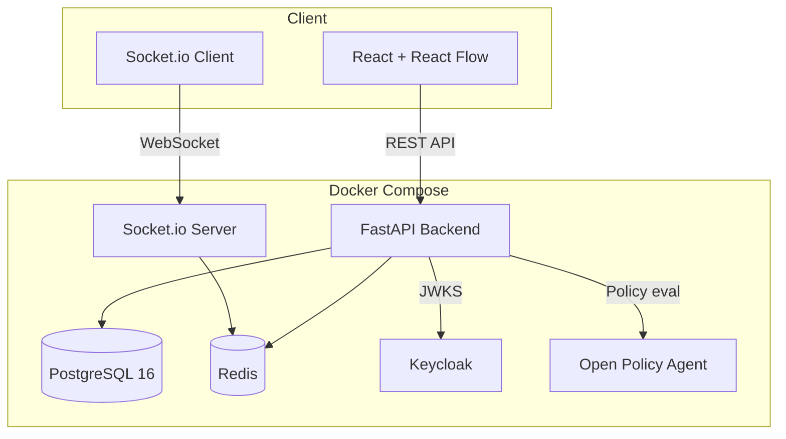

# ZTForge

**Visual Zero Trust Architecture Designer** — design, simulate, and enforce Zero Trust policies on a drag-and-drop canvas.

ZTForge is a self-hosted web application for security teams, DevOps engineers, and homelabbers who want to design and validate Zero Trust architectures visually before deploying them.

> **Status**: MVP — functional core features, not production-hardened yet. Contributions welcome.

## Architecture



## Quick Start

```bash
git clone https://github.com/your-org/ztforge.git
cd ztforge
cp .env.example .env
docker compose up --build
```

| Service | URL | Credentials |
|---------|-----|-------------|
| Frontend | http://localhost:3000 | — |
| Backend API | http://localhost:8000/api/docs | — |
| Keycloak Admin | http://localhost:8080 | admin / admin |
| OPA | http://localhost:8181 | — |

**Demo users** (Keycloak):
- `admin` / `admin123` (admin role)
- `editor` / `editor123` (editor role)
- `viewer` / `viewer123` (viewer role)

## Features

### Canvas Designer
- 6 node types: Identity, Device, Application, Data, Network Segment, Policy Gate
- Drag-and-drop with snap-to-grid
- Edge policies with conditions (MFA, device compliance, time restrictions)
- Minimap and viewport controls
- Optimistic concurrency control (version conflicts detected)

### Real-time Collaboration
- Socket.io rooms per canvas
- Live cursor positions
- Presence indicators
- Node/edge changes broadcast instantly

### Breach Simulator
Deterministic, rule-based simulation engine (no AI/ML). Implements NIST 800-207:
- **Default deny** — no traversal without explicit allow policy
- **Device compliance** — blocks non-compliant devices
- **MFA enforcement** — requires multi-factor authentication
- **Micro-segmentation** — blocks cross-segment traffic
- **Time-based access** — restricts access outside business hours
- Risk score (0-100) with severity levels
- Step-by-step attack path visualization

**8 pre-defined scenarios**: Compromised device, stolen credential, insider threat, expired certificate, lateral from DMZ, data exfiltration, privilege escalation, supply chain compromise.

### Policy Export
Generate production configs from canvas:
- **OPA Rego** — policy bundles
- **Pomerium YAML** — proxy routes
- **Terraform HCL** — network segmentation
- **iptables** — firewall rules

### Policy Hub
Community template marketplace with fork support.

## Tech Stack

| Layer | Technology |
|-------|-----------|
| Backend | Python 3.12, FastAPI, SQLAlchemy 2.x, Pydantic v2 |
| Frontend | React 19, TypeScript, Vite, TailwindCSS v4, React Flow |
| Real-time | python-socketio, socket.io-client |
| Database | PostgreSQL 16 |
| Auth | Keycloak (OIDC + RBAC) |
| Policy | OPA with Rego |
| Cache | Redis |
| Deploy | Docker Compose v2 |

## Security

- JWT validation against Keycloak JWKS (RS256, key rotation support)
- Per-user rate limiting (10 req/sec, Redis sliding window)
- Input validation via Pydantic schemas
- CORS restricted to configured origins
- Structured audit logging for all state mutations
- Default deny on all policy evaluations
- OPA fails closed (deny when unreachable)

## Threat Model

**In scope for MVP**:
- Authentication bypass → mitigated by Keycloak JWKS validation
- Authorization bypass → role-based guards on every endpoint
- Rate abuse → sliding window limiter
- Canvas state corruption → optimistic concurrency control
- XSS via node labels → Pydantic input validation + React escaping

**Out of scope (future work)**:
- DDoS protection (use a reverse proxy like Cloudflare)
- Secret rotation (manual for MVP)
- Multi-tenant isolation (schema-level, not row-level yet)
- E2E encryption of canvas data

## Project Structure

```
ZTForge/
├── backend/          # FastAPI + SQLAlchemy + Socket.io
│   ├── app/
│   │   ├── api/v1/   # Route handlers
│   │   ├── core/     # Config, security, dependencies
│   │   ├── models/   # SQLAlchemy ORM models
│   │   ├── schemas/  # Pydantic validation
│   │   ├── services/ # Business logic
│   │   └── utils/    # Validators
│   └── tests/
├── frontend/         # React + React Flow + TailwindCSS
│   └── src/
│       ├── components/
│       ├── pages/
│       ├── hooks/
│       └── lib/
├── opa/policies/     # Rego policy files
├── docker/           # Keycloak realm config
└── docker-compose.yml
```

## Development

```bash
# Backend
cd backend
python -m venv .venv && source .venv/bin/activate
pip install -r requirements.txt
uvicorn app.main:asgi_app --reload

# Frontend
cd frontend
npm install
npm run dev

# Tests
cd backend
python -m pytest tests/ -v
```

## Contributing

See [CONTRIBUTING.md](CONTRIBUTING.md).

## License

MIT — see [LICENSE](LICENSE).
